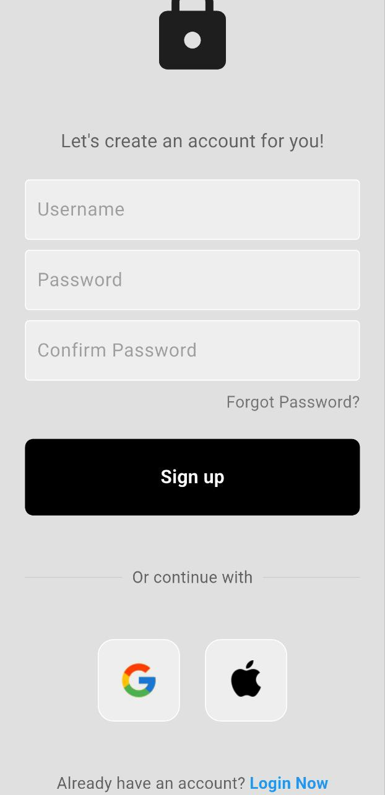
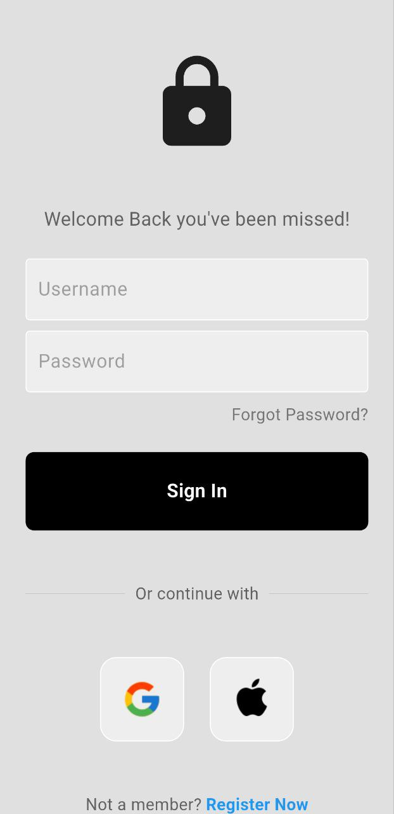

# 🔐 Authentication Practice

A simple Flutter app to practice Firebase Authentication basics, including user registration and login with email & password.

## ✨ Features
- User registration
- Email & password login
- Firebase Authentication integration

## 🔧 Tech Stack
- Flutter
- Firebase Auth
- Material UI

## 🎯 What I Learned
- Setting up Firebase Authentication in Flutter
- Handling form input and validation
- Using async functions for auth (Future)
- Navigating between login and home screens

### ❗️ Issue: Firebase returns `invalid-credential` instead of `user-not-found`

When trying to log in using a wrong email and correct password, Firebase did not return the expected error code `user-not-found`. Instead, it returned a more generic code: `invalid-credential`.

📌 **Reason**: For security reasons, Firebase sometimes returns general error codes (like `invalid-credential`) to avoid revealing whether an email is registered or not.

✅ **Solution**:  
I added an extra check for `invalid-credential` and showed a generic error message to the user, such as "Invalid email or password", instead of trying to differentiate between email or password errors.

### ❗️ Issue: UI Overflow on Smaller Screens

When trying to display the login form, a layout overflow occurred on smaller screens (especially when the keyboard was open).

📌 **Reason**: The layout was too tall for the available screen space and caused a "Bottom overflowed by XX pixels" error.

✅ **Solution**:  
I wrapped the main content of the screen with a `SingleChildScrollView` to make it scrollable, which fixed the overflow issue on small or constrained screens.

## 📸 Screenshots

  
  

