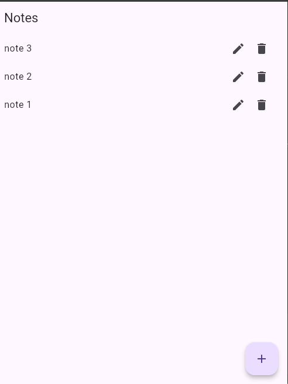

# 📝 Flutter Notes App with Firebase

A simple Flutter app to create, update, and delete notes in real-time using **Cloud Firestore**. Built as a practice project following a tutorial.

  

---

## ✨ Features

- ➕ Add new notes
- ✏️ Edit existing notes
- 🗑️ Delete notes
- 🔄 Real-time sync using Firestore streams
- 📦 Firebase integration (Firestore)
- 🧠 Simple state management with `setState`

---

## 🛠 Tech Stack

- Flutter
- Firebase Core
- Cloud Firestore

---

## 🧠 What I Learned

- Firebase initialization in Flutter
- CRUD operations with Firestore
- Using `StreamBuilder` for real-time updates
- Managing state using `TextEditingController` and `setState`

---
