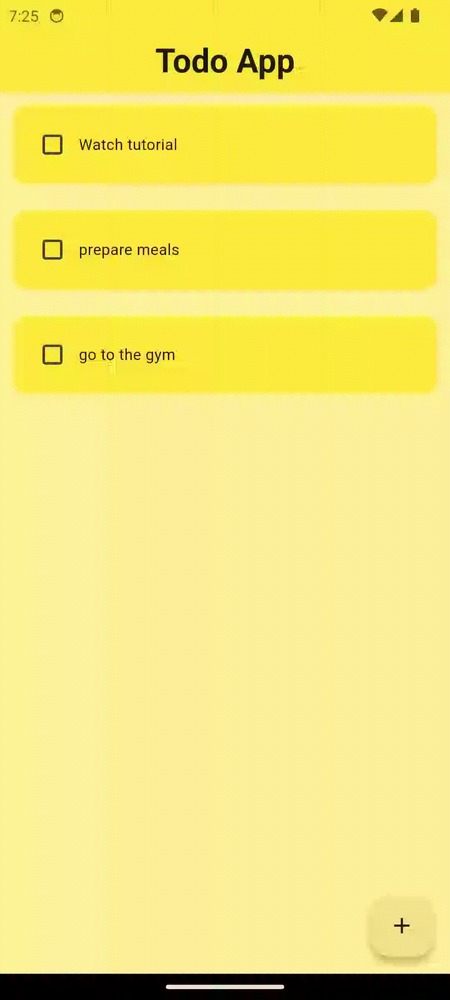

# 📝 To-Do App with Hive 🐝

This is a simple **Flutter To-Do App** that allows users to manage daily tasks.  
It supports task creation, checkbox completion, deletion with swipe gesture, and local data persistence using **Hive**.

  

---

## ✨ Features

- ✅ Add new tasks  
- 🗑️ Swipe to delete (Slidable)  
- ✔️ Mark tasks as completed  
- 💾 Persistent local storage using Hive  
- 💡 Clean UI using Flutter Material Design  
- 📦 State managed via `setState`

---

## 🔧 Tech Stack

- **Flutter**
- **Hive** (local NoSQL database)
- **flutter_slidable**

---

## 🎯 What I Learned

- 🔸 How to use **Hive** for lightweight local data persistence  
- 🔸 Using **Slidable** for swipe-to-delete functionality  
- 🔸 Custom dialog creation with `AlertDialog`   
- 🔸 State management with `setState`  